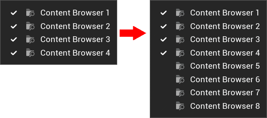
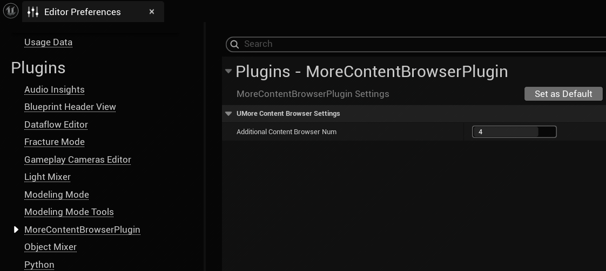
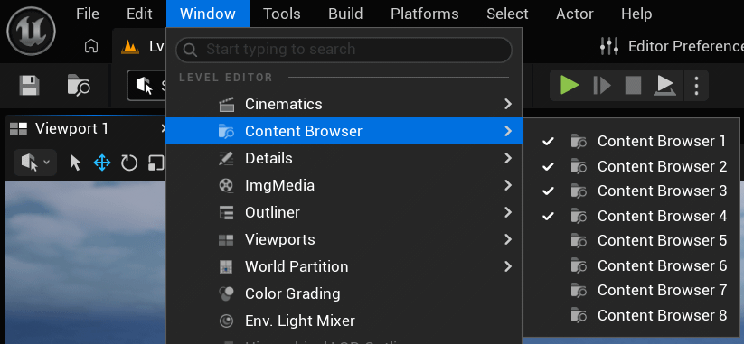
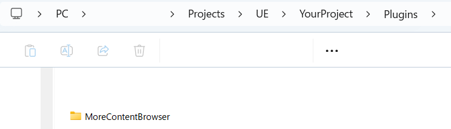

# MoreContentBrowser UE5 Plugin Document

## Table of Content

- [MoreContentBrowser UE5 Plugin Document](#morecontentbrowser-ue5-plugin-document)
  - [Table of Content](#table-of-content)
  - [Overview](#overview)
  - [Background of the Development](#background-of-the-development)
  - [Plugin settings](#plugin-settings)
  - [How to Install](#how-to-install)
  - [How to Build](#how-to-build)
    - [If a solution file (.sln) is not generated](#if-a-solution-file-sln-is-not-generated)
  - [Features](#features)
    - [File Tree](#file-tree)
  - [概要](#概要)
  - [開発の背景](#開発の背景)
  - [プラグイン設定](#プラグイン設定)
  - [インストール方法](#インストール方法)
  - [ビルド方法](#ビルド方法)
    - [ソリューションファイル（.sln）が生成されない場合](#ソリューションファイルslnが生成されない場合)
  - [機能](#機能)
    - [ファイルツリー](#ファイルツリー)

## Overview

This is a plugin that increases the number of Content Browser panels in UE5.  

  

## Background of the Development

Unreal Engine limits the number of Content Browser panels by default to maintain editor performance in large projects.  

This plugin gives you the option to extend that limit when your workflow requires multiple panels (Up to 9 panels) , helping you manage assets faster and more efficiently.  

> Note: Opening many Content Browsers may impact performance depending on your project size.  

In developing this product, we are aiming to achieve the following:  

- Simple and lightweight implementation
- Seamless integration with UE5 Editor

## Plugin settings

The settings can be found under:
"Editor Preferences" → "Plugins"

  

| Name | Effect | Default value |
|-|-|-|
| Additional Content Browser Num | The number of ContentBrowsers added by this plugin | 4 |

  

## How to Install

This plugin is available for Unreal Engine 5.7 and later.  

To install it, place the plugin in the "Plugins" folder inside your project directory.  
If the "Plugins" folder does not exist, create it manually.  

  

## How to Build

Since this is a code plugin, you will need to compile and build it after installation.  

For more details, please refer to the official documentation  
[Compiling Game Projects](https://dev.epicgames.com/documentation/unreal-engine/compiling-game-projects-in-unreal-engine-using-cplusplus)  

Visual Studio is available here:
→ [microsoft.com](https://visualstudio.microsoft.com/vs/community/)  

The following site is also a useful reference when installing Visual Studio:  
→ [ue5study.com](https://ue5study.com/how/unrealengine-packaging-visualstudio-settings/)  

### If a solution file (.sln) is not generated

If you see an error like this:

  > This project does not have any source code. You need to add C++ source files to the project from the Editor before you can generate project files.  
  > For projects without source code, you must first add source code.  

You can fix it by adding an empty C++ class to the project.  

Steps:

- Select "New C++ Class" in the Editor
- Tools → New C++ Class...
- Choose "None" → Next → Create Class
- Click OK → Yes

## Features

- Add multiple Content Browser panels
- Adjustable number of additional panels
- View multiple Content Browsers at the same time
- The newly added content browser includes standard features such as context menu operations, bookmarks, and display customization.

### File Tree

```txt
MoreContentBrowser
│  MoreContentBrowser.uplugin
│
├─Content
├─Resources
│      Icon128.png
│
└─Source
    └─MoreContentBrowserModule
        │  MoreContentBrowserModule.Build.cs
        │
        ├─Private
        │      MoreContentBrowserModule.cpp
        │      MoreContentBrowserSettings.cpp
        │      MoreContentBrowserSingleton.cpp
        │
        └─Public
                MoreContentBrowserModule.h
                MoreContentBrowserSettings.h
                MoreContentBrowserSingleton.h
```

Plugin Modules (JSON):  

```json
    "Modules": [
        {
            "Name": "MoreContentBrowserModule",
            "Type": "Editor",
            "LoadingPhase": "Default"
        }
    ]
```

This is a plugin for the editor only.  

Engine Version: 5.7  

Target Platform: Windows  

---

## 概要

これは UE5 の Content Browser パネルの数を増やすプラグインです。  

  

## 開発の背景

Unreal Engineでは、大規模なプロジェクトにおけるエディタのパフォーマンスを維持するため、デフォルトでコンテンツブラウザのパネル数が制限されています。  

このプラグインを使用すると、ワークフロー上複数のパネルが必要な場合にその制限を解除できるようになり (最大 9 枚まで)、アセットをより迅速かつ効率的に管理できるようになります。  

> 注意：プロジェクトの規模によっては、コンテンツブラウザを多数開くとパフォーマンスに影響が出る場合があります。  

開発に当たっては、以下を目指して作っています：  

- シンプルで軽量な実装
- UE5エディタとのシームレスな統合

## プラグイン設定

設定について  

設定は「Editor Preferences」→「Plugins」から確認できます。  

  

| 名前 | 内容 | 初期値 |
|-|-|-|
| Additional Content Browser Num | このプラグインによって追加されるContent Browserの数 | 4 |

  

## インストール方法

このプラグインはUnreal Engine 5.7以降に対応しています。  

インストールするには、エンジンフォルダ内の「Plugins」フォルダに配置してください。  
もし「Plugins」フォルダが存在しない場合は、自分で作成してください。  

  

## ビルド方法

このプラグインはコードプラグインのため、インストール後にコンパイル&ビルドが必要です。  

詳細については公式ドキュメントに従ってください
[ゲーム プロジェクトをコンパイルする](https://dev.epicgames.com/documentation/unreal-engine/compiling-game-projects-in-unreal-engine-using-cplusplus)  

Visual Studioはこちら：  
→ [microsoft.com](https://visualstudio.microsoft.com/vs/community/)  

Visual Studioのインストール時には以下のサイトも参考になります：  
→ [ue5study.com](https://ue5study.com/how/unrealengine-packaging-visualstudio-settings/)  

### ソリューションファイル（.sln）が生成されない場合

以下のようなエラーが表示される場合：

  > This project does not have any source code. You need to add C++ source files to the project from the Editor before you can generate project files.  
  > For projects without source code, you must first add source code.  

この場合、プロジェクトに空のC++クラスを追加することで解決できます。  

手順：

- エディタで「New C++ Class」を選択  
- Tools → New C++ Class...  
- None → Next → Create Class  
- OK → Yes  

これでクラスが作成されます。

## 機能

- 複数のコンテンツブラウザパネルを追加可能
- 追加パネルの数を調整可能
- 複数のコンテンツブラウザを同時に表示可能
- 追加されたコンテンツブラウザは、メニュー操作、お気に入り、表示カスタマイズ等標準の機能を有している

### ファイルツリー

```txt
MoreContentBrowser
│  MoreContentBrowser.uplugin
│
├─Content
├─Resources
│      Icon128.png
│
└─Source
    └─MoreContentBrowserModule
        │  MoreContentBrowserModule.Build.cs
        │
        ├─Private
        │      MoreContentBrowserModule.cpp
        │      MoreContentBrowserSettings.cpp
        │      MoreContentBrowserSingleton.cpp
        │
        └─Public
                MoreContentBrowserModule.h
                MoreContentBrowserSettings.h
                MoreContentBrowserSingleton.h
```

プラグイン内のモジュール設定 (JSON)：  

```json
    "Modules": [
        {
            "Name": "MoreContentBrowserModule",
            "Type": "Editor",
            "LoadingPhase": "Default"
        }
    ]
```

これはエディター専用プラグインです  

対応エンジンバージョン: 5.7  

対応プラットフォーム: Windows  
